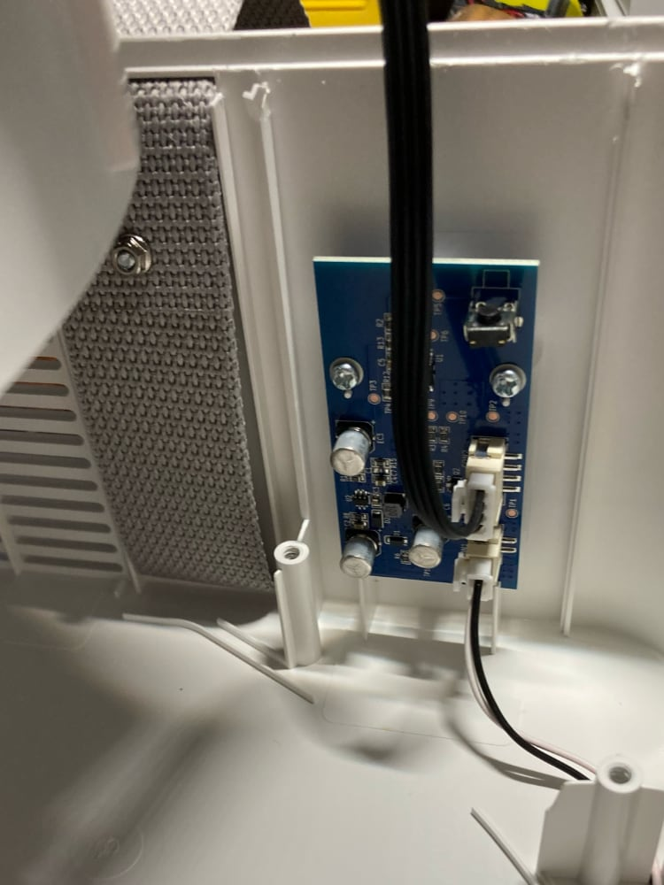
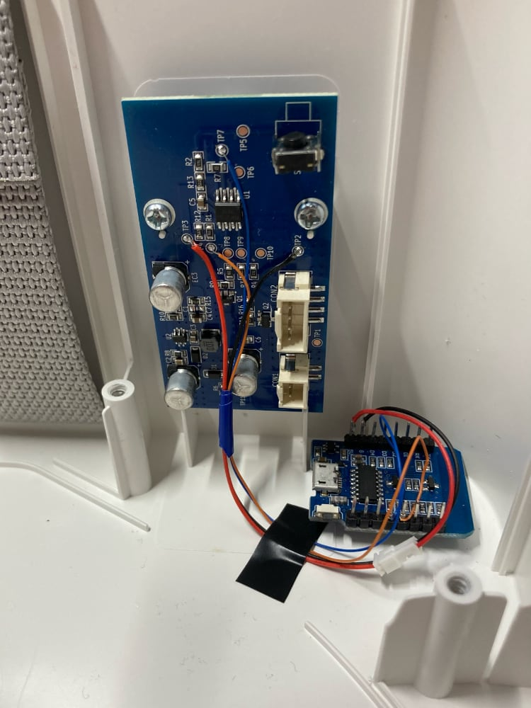

# ESPHome + Ikea UPPÅTVIND

> See also [horvathgergo/esp8266-for-uppatvind](https://github.com/horvathgergo/esp8266-for-uppatvind) which is a project to replace the board in the UPPÅTVIND with a custom board powered by an ESP866.

## Overview

This is a modification of the [Ikea UPPÅTVIND](https://www.ikea.com/us/en/p/uppatvind-air-purifier-60498228/) air purifier into a "smart" purifier, specifically by using ESP8266 or ESP32 wifi microcontroller with [ESPHome](https://esphome.io/) so that the air purifier can be remotely controlled by [Home Assistant](https://www.home-assistant.io/).

The goal is to be able to remotely:
- View UPPÅTVIND fan speed
- Change the UPPÅTVIND fan speed

This can be done using an ESP8266 or ESP32 to:
- Sense the LED brightness, which matches the fans speed (off, low, medium, high) 
- Press the button to change the fan speed


## Disassembly of the UPPÅTVIND

The case is held together with triangle head screws:


A T8 Torx bit fits in these screws.

After removing the 5 triangle screws, the face is still held on by clips along the edge. I jammed a flat head screwdriver into the gaps and broke each of the inside clips along the edges.

The board is powered from by 24V DC from the 2-pin connector.

The 24V is stepped down to 5V (U2 and surrounding components make a switched-mode power supply)

There is 8-pin microcontroller (U1) that reads the inputs from the 2 buttons, controls the 2 LEDs, enables the fan power, and generates the PWM to set the fan speed.

The microcontroller runs off of 5V  





## Wiring

I used a Wemos D1 ESP8266 board since I had a one on hand. Any ESP8266 or ESP32 would work provided it can run off of 5V power, e.g. the board has a voltage regular.


 ⚠️ For signal voltage, the UPPÅTVIND MCU signals are at 5V and ESP8266/ESP32 are 3.3V (I think both are rated up to 3.6V). To be safe you _should_ use a level-shifter between UPPÅTVIND and the ESP chip. I didn't and it works ok.


| UPPÅTVIND | Wemos D1 | Notes                                                      |
| --------- | -------- | ---------------------------------------------------------- |
| TP2       | GND      |
| TP3       | 5V       |
| TP4       | D5       | TP4 is between the button switch at S1 and the UPPÅTVIND   |
| TP7       | D6       | TP7 is between anode (positive) side of LED1 the UPPÅTVIND |


### Button

The main button the UPPÅTVIND is active-low switch. It's schematic is like:
```
               S1
              _|_
U1--R1--TP4--o   o--GND
```

The 8-pin MCU U1 is set up as an pulled-up input pin. When the S1 is pressed it grounds the pins.

For the Wemos D1 to trigger the input, a Wemos output pin is connected to exposed cooper at TP4. The Wemos can then momentary set it's output pin to low similar to physically pressing the button at S1.


```
               S1
              _|_
U1--R1--TP4--o   o--GND
         |
         |
       Wemos
```

### LED

The main LED (LED1) of the UPPÅTVIND has 4 states, off, and low, medium, and high brightnesses. The PWM is used to control the brightness.

The LED has similar wiring but instead of the Wemos using an output ping, the it'll uses an input pin connected to TP7. The Wemos can then measure the pulse width to sense the LED brightness.


```
U1--TP7--LED1--GND
     |
     |
   Wemos
```





## ESPHome

[ESPHome](https://esphome.io/)


Example ESPHome YAML configuration file

```yaml
esphome:
  name: uppatvind

esp8266:
  board: d1

sensor:
  - platform: pulse_width
    pin: D6
    id: led1
    name: UPPÅTVIND Fan Speed LED
    update_interval: 0.25s
    accuracy_decimals: 0
    unit_of_measurement: ""
    icon: mdi:led-outline
    filters:
      # The values after multiplied by 1000000 are 0, 20, 100, 320
      # and correspond to LED being off, low, med, high intensity.
      # The "pulse_width" sensor sometimes reads non-0 (e.g 221) when
      # the LED is off which is why 0 (off state) is returned in the
      # default case.
      - multiply: 1000000
      - lambda: !lambda |- 
          switch (int(x)) {
            case 20:
              return 1;
            case 100:
              return 2;
            case 320:
              return 3;
            default:
              return 0;
          }
      - max:
          window_size: 3
          send_every: 3
          send_first_at: 1
      - or:
        - delta: 0.5
        - throttle: 60s

output:
  - platform: gpio
    pin:
      number: D5
      inverted: true  
      # "Open drain" used so the Wemos does't pull the pin 
      # up or down when it's not being pressed.
      mode: OUTPUT_OPEN_DRAIN
    id: output1

button:
  - platform: output
    name: "UPPÅTVIND Button"
    output: output1
    duration: 100ms
```

## Change Filter LED

There is a red LED on the UPPÅTVIND for the filter change indicator. This LED seems to briefly turns on when the UPPÅTVIND powers up, and I assume it'll turn on when the filter needs to be changed. I haven't had the UPPÅTVIND long enough for the LED to turn on. It's probably based on total runtime time since Ikea suggests changing filter 6 months.

This LED (which is at LED2/TP6) could also be wired up to the ESP8266/ESP32 so its state can be sent to Home Assistant to trigger a notification.
